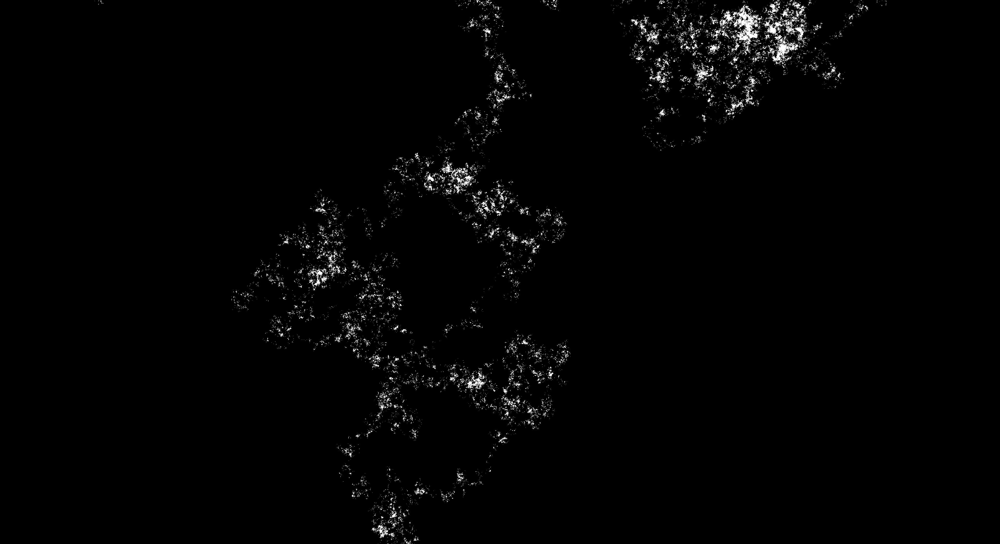

# plane-cleaners

## What is it?
This program simulates greedy cleaners (also known as a greedy walk) on a plane, which can be described as so:

1. Scatter points of 'dust' on $\mathbb{R}^2$ according to a Poisson process (the parametter $\lambda > 0$ is unimportant, so `plane-cleaners` picks 1 for efficiency).
2. Create $n$ 'cleaners' at the origin.
3. We loop the following forever, iterating over each cleaner in turn:
    1. Find the nearest 'cleaners' to the cleaner.
    2. Delete it.

`plane-cleaners` allows you to watch the behaviour of these cleaners in their space in real time.

## Can I have nice pictures
These pictures are generated by hitting `p` when the program is running:

1 cleaner, 282664050 iters:

100 cleaners, 17587400 iters:

## Caveats
`plane-cleaners` will use all the resources it can to run the simulation. This means it will gobble more and more RAM,
and hammer your CPUs as much as it needs to run as fast as possible, which could result in system crashes.
A system to swap out unused chunks to disk is being worked on, which should help with the memory exhaustion issues.

## How does it work?
Simulating the whole of $\mathbb{R}^2$ is not really a feasible solution. Instead, we use the following property of the $n$-dimensional Poisson process:

> The distribution of points in disjoint $A_i \subset \mathbb{R}^n$ is independent. 
> Furthermore, the number of points in $A_i$ is distributed according to a Poisson distribution with rate equal to 
> $\lambda$ multiplied by the Lebesgue measure of $A_i$, and each point in $A_i$ is uniformly distributed.

We can therefore reduce $\mathbb{R}^2$ into the union of countably many disjoint similar squares, 
which are both easy to take the area of, and to tile. These squares are referred to as `chunks` in the code, and are dynamically
generated and saved. 
`plane-cleaners` actually generates a backlog of chunks in parallel, and translates them into place when a new chunk is needed.

Let:
* $S$ be the chunk side width
* $c$ be a point in some chunk with centre $C$

We can then find the nearest dust particle to $c$ by looping the following for $i \geq 0$, 
with some current best option $c'$ and iteration upper bound $b = \infty$:
1. If $i > b$, return $c'$.
1. Take the $L_\infty$-circle of chunks with radius $i \times S$, and try to find the closest dust particle in it.
2. If there are none, skip to the next iteration.
3. Set $c'$ to this closest point (if it is closer than the old value of $c'$).
4. Set $b = \frac{d_\infty(c, C) + d_2(c, c')}{S} + \frac{1}{2}$.

The bound can be justified like so, with $C'$ being the centre of the chunk of some $c'$, and the same with $C_f$ and $c_f$ representing the closest piece of dust:

> $d_\infty(C, C_f)$

By the triangle inequality, we have:
> $\leq d_\infty(C, c) + d_\infty(c, c_f) + d_\infty(c_f, C_f)$

By the fact that $d_\infty \leq d_2$, and $d_\infty(c_f, C_f) < \frac{S}{2}$, we get:
> $\leq d_\infty(C, c) + d_2(c, c_f) + \frac{S}{2}$

Finally, since $d_2(c_f, C_f) \leq d_2(c', C')$ by definition:
> $\leq d_\infty(C, c) + d_2(c, c') + \frac{S}{2}$

Dividing through by $S$ gets you the required bound.

This algorithm allows us to find the closest point without having to generate the entire plane, and thus making this problem computable.

## Credit
This is a part of my University of Liverpool MATH490 project, supervised by Prof. Takis Konstantopoulos. 
All the code is mine, with the exception of a few lines of code taken from the SDL2 example sources to get the graphics working,
and the PCG code in the [pcg-cpp](pcg-cpp/) git submodule, but it would not have been possible without the detailed mathematical explanation provided by my supervisor.
